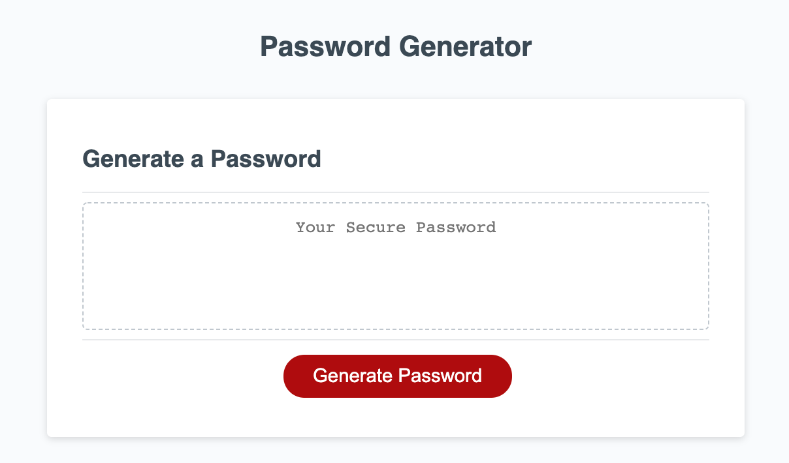

# PasswordFun

Create an application that generates a random password based on user-selected criteria. This app will run in the browser and feature dynamically updated HTML and CSS powered by your JavaScript code. It will also feature a clean and polished user interface and be responsive, ensuring that it adapts to multiple screen sizes.


## User Story

```
AS AN employee with access to sensitive data
I WANT to randomly generate a password that meets certain criteria
SO THAT I can create a strong password that provides greater security
```

## Demo of the Application

https://drive.google.com/file/d/1js2Pk1LCzqqZth5eKdTks3IRoHRjoWf9/view?usp=sharing

## Access to the Application

* The URL of the deployed application.
https://andrewcircelli.github.io/PasswordFun/

* The URL of the GitHub repository. Give the repository a unique name and include a README describing the project.
https://github.com/andrewcircelli/PasswordFun

## Screenshots of the Application
<!-- Password Gnerator Start -->

